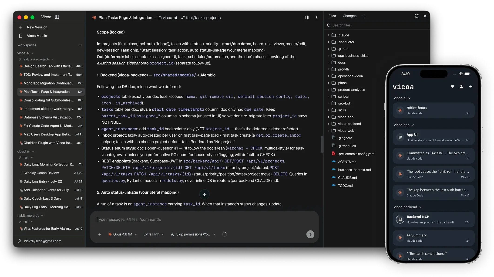
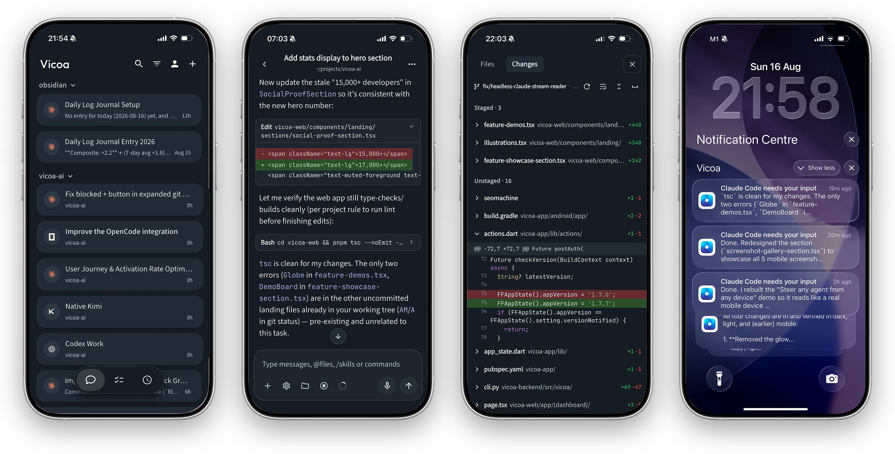

<div align="center">

<h1 align="center">
   Vicoa
</h1>

<p align="center">
  <a href="https://vicoa.ai"></a>
  
  
  <a href="https://discord.gg/mqz4qRPV4j"></a>
  <a href="https://x.com/vicoaai"></a>
</p>

**[English](./README.md) | 简体中文**

Vicoa 是一个开源的 **AI 编排器**，让你在任意设备上运行一支编程智能体团队。

<h3 align="center"><a href="https://vicoa.ai/download"><ins>下载 Vicoa</ins></a></h3>

</div>

<p align="center">
  
</p>

<p align="center">
  <sub><em>在桌前开始，在口袋里继续。</em></sub>
</p>

---

## 运行一支编程智能体团队

*Claude Code、Codex、Cursor、Kimi 等等*

- **[支持的智能体](#支持的智能体)：** Claude Code、Codex、OpenCode、Gemini、Cursor、GitHub Copilot、Kimi、Hermes —— 在同一个工作区里并排运行。
- **并行 worktree：** 每个智能体都在自己的 git worktree 和分支上，好几个可以同时改同一个仓库、互不干扰。
- **一个指挥台：** 所有会话的状态集中成一张列表，在一处指挥整支队伍，不用翻终端标签页。
- **[任意机器](https://vicoa.ai/docs/start-remote-session)：** 你的 Mac、Windows 笔记本、Linux 机器、VPS、远程服务器 —— 全都连上，再决定每个会话跑在哪台。
- **[自带密钥](https://vicoa.ai/docs/alternative-models)：** 用你现有的订阅或 API key。

## 随时随地指挥智能体

*笔记本上开的那个会话，就在你口袋里。*

- **[iOS 与 Android 应用](https://vicoa.ai/download)：** 同一个会话，跑在原生移动端应用里。
- **通知：** 智能体需要你决策或完成任务时才提醒你。
- **随处 vibe coding：** 用手机就能给项目里的智能体发提示词，所有会话实时同步。
- **[@文件 与 /命令](https://vicoa.ai/docs/vicoa-features)：** 文件模糊搜索和智能体自带的斜杠命令，在网页、手机和 CLI 上一样好用。
- **[语音输入](https://vicoa.ai/docs/vicoa-features#talk-to-code-dictation)**

<p align="center">
  
</p>

<p align="center">
  <sub><em>一个真正的移动端编程 App，而不是聊天标签页：会话、对话、实时 git diff 与推送通知。</em></sub>
</p>

## 更多功能

- **查看改动** 按文件的改动与提交历史，在桌面和手机上都能审。
- **文件浏览器：** 对话旁边就是文件树。
- **终端：** 在任务会话旁边跑命令。
- **[移动端实时预览](https://vicoa.ai/docs/live-preview)：** 打开本地开发服务器，用手机以桌面模式预览。
- **任务管理：** 在看板上规划工作，然后从任务直接开一个会话，或用自动化让智能体自动接手。
- **[自动化](https://vicoa.ai/docs/cli-commands#vicoa-automation)：** cron 定时把事情自动办了。
- **技能（Skills）：** 查看、安装、卸载智能体技能。
- **[CLI](https://vicoa.ai/docs/cli-commands)：** 会话、对话记录、任务和自动化都支持 CLI，你的智能体可以像你一样驱动 Vicoa。
- 还有更多……

---

## 开始使用

下载 **[Vicoa 桌面端](https://vicoa.ai/download)**，支持 macOS、Windows、Linux。它会把所在的这台
电脑连上，并自动识别上面已经装好的智能体。

唯一的前提：跑智能体的那台机器上，至少装好并登录一个[支持的智能体 CLI](#支持的智能体)。

更习惯终端？

```bash
npm i -g @vicoa/cli     # 需要 Node.js 18+；Intel Mac 或 glibc 较旧的系统请用：pip install vicoa
vicoa                   # 在当前目录开一个会话 —— 或用 `vicoa daemon` 只把这台机器连上
```

## 三分钟跑通第一个会话

**1. 安装并登录。** 打开 [Vicoa 桌面端](https://vicoa.ai/download) 并登录。

**2. 启动几个智能体。** 点 **New Session**，选择机器、智能体，输入第一条提示词。

**3. 用手机接管。** 装上 Vicoa 移动端应用，用同一个账号登录 —— 正在跑的会话会自动同步过来。

<p align="center">
  <a href="https://apps.apple.com/app/id6751626168"></a>
  &nbsp;
  <a href="https://play.google.com/store/apps/details?id=app.vicoa"></a>
</p>

完整教程：[安装配置 Vicoa](https://vicoa.ai/docs/getting-started) ·
[启动远程会话](https://vicoa.ai/docs/start-remote-session)

## 支持的智能体

Vicoa 启动的是你早就装好并登录过的智能体 CLI，跑在你的机器上、用你的凭证。

| 智能体 | CLI | 智能体 | CLI |
| --- | --- | --- | --- |
| [Claude Code](https://vicoa.ai/docs/agents/claude-code) | `claude` | [Cursor](https://vicoa.ai/docs/agents/more-coding-agents) | `cursor-agent` |
| [Codex](https://vicoa.ai/docs/agents/codex) | `codex` | [GitHub Copilot](https://vicoa.ai/docs/agents/more-coding-agents) | `copilot` |
| [OpenCode](https://vicoa.ai/docs/agents/opencode) | `opencode` | [Kimi](https://vicoa.ai/docs/agents/more-coding-agents) | `kimi` |
| [Gemini](https://vicoa.ai/docs/agents/more-coding-agents) | `gemini` | [Hermes](https://vicoa.ai/docs/agents/more-coding-agents) | `hermes` |

Claude Code 和 Codex 是原生集成，其余通过 Agent Client Protocol（ACP）接入。

## 文档

- **[CLI 命令](https://vicoa.ai/docs/cli-commands)** —— 在终端里驱动 Vicoa 的会话、任务与自动化。
- **[自托管](./SELF_HOSTING.md)** —— 用 Docker 把整套栈跑在你自己的基础设施上。
- **[快速上手](https://vicoa.ai/docs/getting-started)** —— 安装、登录、跑通第一个会话。
- **[支持的智能体](https://vicoa.ai/docs/agents)** —— 配置 Claude Code、Codex 及其余智能体。
- **[部分功能](https://vicoa.ai/docs/vicoa-features)** —— 功能介绍
- **[完整文档 →](https://vicoa.ai/docs)**

## 本仓库包含什么

这是 **Vicoa 开源版** —— 完整、可自托管的整套：

- **CLI 与本地守护进程：** 在一台机器上启动并运行编程智能体。
- **后端：** 面向认证、会话、消息、任务、自动化的后端 API 与实时服务。用 Postgres 即可自托管。
- **各端客户端：** 网页端、桌面端、移动端应用（iOS / Android）。

Vicoa 采用**自带订阅或密钥**模式：你使用自己的智能体 / 模型订阅或 API key。

## 自托管

用 Docker 跑起整套：

```bash
cp .env.example .env                                  # 口令、各个公开 URL
./backend/scripts/generate-jwt-keys.sh selfhost/keys
docker compose -f docker-compose.selfhost.yml up -d
```

完整说明见 **[SELF_HOSTING.md](./SELF_HOSTING.md)**。

## 架构

```
     Web  ·  桌面端 (macOS/Windows)  ·  iOS  ·  Android  ·  CLI
                            │
                            ▼
  ┌──────────────┐   ┌────────────────┐   ┌──────────────────┐
  │   Next.js    │──>│    FastAPI     │──>│    PostgreSQL    │
  │   仪表盘     │<──│   后端 + WS    │<──│                  │
  └──────────────┘   └───────┬────────┘   └──────────────────┘
                             │  会话与消息走 WebSocket
                     ┌───────┴───────┐
                     │  vicoa 守护   │  跑在你自己的机器上，紧挨着你的代码
                     └───────┬───────┘
                             │  启动
                     ┌───────┴─────────────────────────────────┐
                     │ Claude Code · Codex · OpenCode · Gemini │
                     │ Cursor · Copilot · Kimi · Hermes        │
                     └─────────────────────────────────────────┘
```

| 层 | 技术栈 |
| --- | --- |
| Web | Next.js 15 + React 19、shadcn/ui，文档用 Fumadocs |
| 桌面端 | Electron，运行 Web UI 并托管一个内置守护进程 |
| 移动端 | Flutter（iOS / Android） |
| 后端 | Python 3.10+ / FastAPI —— 面向用户的 REST API，以及面向智能体的 REST + WebSocket 服务 |
| 数据库 | PostgreSQL（SQLAlchemy + Alembic） |
| 智能体运行时 | 本地 `vicoa` 守护进程，负责启动上面那些智能体 CLI |

## 参与开发

先看 **[贡献指南](./CONTRIBUTING.md)**。

目录结构速览：

```
vicoa/
├── backend/              # Python：FastAPI 后端、REST 服务、CLI 与守护进程
│       └── vicoa/        # `vicoa` CLI 与本地守护进程
├── apps/
│   ├── web/              # Next.js 网页前端（同时也是桌面端渲染层）与文档
│   ├── desktop/          # Electron 桌面应用
│   └── mobile/           # Flutter 应用（iOS / Android）
```

常用命令：
```bash
# 后端、CLI 与守护进程（Python）
cd backend
make dev-install
./dev-start.sh

make lint && make test

# 网页端与文档（Next.js）
cd apps/web && pnpm install && pnpm dev

# 桌面应用（Electron）—— 见 apps/desktop/README.md
cd apps/desktop && pnpm install && pnpm dev

# 移动应用（Flutter）
cd apps/mobile && flutter pub get && flutter run
```

## 社区与支持

- **Discord** —— 加入社区 **[discord.gg/mqz4qRPV4j](https://discord.gg/mqz4qRPV4j)**，答疑与讨论。
- **Twitter / X** —— 关注 **[@vicoaai](https://x.com/vicoaai)**，获取更新与发布动态。
- **反馈与想法** —— 我们在快速迭代中，缺了什么功能？欢迎[提需求](https://github.com/vicoa-ai/vicoa/issues)，并附上平台、版本和复现步骤（详见 [CONTRIBUTING.md](./CONTRIBUTING.md)）。
- **安全问题** —— 请勿以公开 issue 形式提交，按 [SECURITY.md](./SECURITY.md) 走私密渠道。
- **支持我们** —— 给仓库点个 **[Star](https://github.com/vicoa-ai/vicoa)**，追踪我们每天的更新。

## 许可证

Vicoa 采用 [AGPLv3](./LICENSE) 开源许可证。
